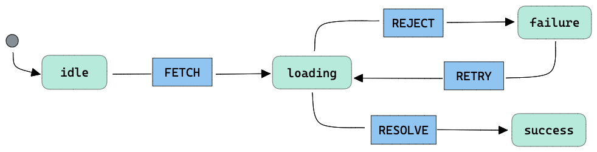
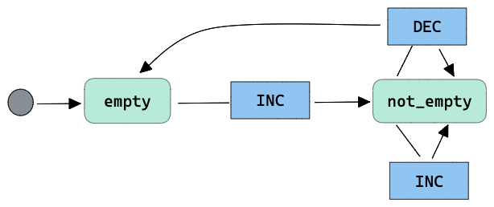
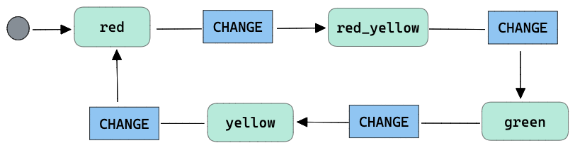

# type-machine

# Machine creation

To create a new machine we should use `createMachine` function:

```ts
import { createMachine } from '@machine/core';
```

Example:



Let's create a simple state machine that represent a fetch request:

```ts
const requestMachine = createMachine({
    type: 'D',
    initial: 'idle',
    states: {
        idle: {
            on:{
                FETCH: () => 'loading'
            }
        },
        loading: {
            on: {
                RESOLVE: () => 'success',
                REJECT: () => ({ target: 'failure' })
            }
        },
        failure: {
            on: {
                RETRY: () => 'loading',
            }
        },
        success: {}
    }
})
```

In the machine definition object we find:

* `type`: this is the machine type it could be `D` for a deterministic machine or `ND` for a non-deterministic machine.
* `initial`: this is a string the specify the machine initial state.
* `states`: object where every key represent a machine state. 

## State definition

In the example above we see that each state should have a property `on`, which is an object where every key of it define an event supported in the current state. 
For every event key we have a transition function defining the next machine after this event. For example: 

```ts
idle: {
    on:{
        FETCH: () => 'loading'
    }
},
```

this means that on `idle` state we can receive `FETCH` event, after it we go from `idle` to `loading` state.

## Querying machine state

```ts
requestMachine.state() // idle
```

Every machine has a `state()` function that returns at any moment in which state is the machine currently

## Sending machine events

The state machine supports different events, by sending them we allow transitions between different states

```ts
requestMachine.state() // initial state 'idle'

requestMachine.send({ event: 'FETCH' });

requestMachine.state(); // next state 'loading'
```

## Machine non-deterministic 

Above was mentioned that a machine could be either `deterministic` or `non-deterministic`. A non-deterministic machine of `type: 'ND'` supports an internal `context` which can store information that can be used internally by the 
machine during some state transition, a machine that rely on the context information to execute a transition could go from  state `S1` to states 
`S2` or `S3` depending on the context, for that reason they are considered non-deterministic. 

Let's see an example of this kind of machine, we will have a `counterMachine` which could have two possible states `empty` or `non-empty`:



Before see the code for the definition of the previous machine let's take a closer look to our `not-empty` state.

This state support events `INC` 
and `DEC`, in the case of `INC` we remain in the same state whenever it is emitted, but for `DEC` event we could go either to `empty` state or keep the machine as 
`not-empty`, the next state  after `DEC` event doesn't depends only in the current machine state but also in the internal machine context, for
this reason this machine is considered `non-deterministic`.

```ts
const counterMachine = createMachine({
        type: "ND",
        context: {
            count: 0,
        },
        initial: "empty",
        states: {
            empty: {
                on: {
                    INC: ({ context }) => {
                        const { count } = context.get();
                        context.set({ count: count + 1 });
                        return "not_empty";
                    },
                },
            },
            not_empty: {
                on: {
                    INC: ({ context }) => {
                        const { count } = context.get();
                        context.set({ count: count + 1 });
                        return { target: "not_empty" };
                    },
                    DEC: ({ context }) => {
                        const { count } = context.get();
                        context.set({ count: count - 1 });
                        return context.get().count === 0
                            ? "empty"
                            : { target: "not_empty" };
                    },
                },
            },
        },
    });
}

```

From the prvious machine definition we could see that the main differences compared to machines of `type: 'D'`, are the `context` property as part
of the machine declaration, and the `context` parameter passed to every transition function. As we mentioned before during the `DEC`event our machine
depends on the `context` data to decide which is the new machine state.

# Machines combination

```ts
import { combineMachines } from '@machine/core';
```

Is possible combine two or more different state machines to create a new one composed from them.

Let's say we have the following traffic light machine:



This machine model a traffic with initial state `red` and support one a `CHANGE` event, the following code create the previous machine:

```ts
const trafficLightMachine = createMachine({
    type: 'D',
    initial: 'red',
    states: {
        red: {
            on: {
                CHANGE: () => 'red_yellow',
            }
        },
        red_yellow: {
            on: {
                CHANGE: () => 'green',
            }
        },
        green: {
            on: {
                CHANGE: () => 'yellow',
            }
        },
        yellow: {
            on: {
                CHANGE: () => 'red',
            }
        }
    }
})

```

We can combine this machine with our previous `fetchMachine` to build a new one like:

```ts
const m = combineMachines({
        trafficLight: trafficLightMachine,
        request: requestMachine
    });
```

After this our new `m` machine have the following state:

```ts
m.state(); // { trafficLight: 'red', request: 'idle' }
```

It supports events either for `requestMachine` or `trafficLightMachine`:

```ts
m.send({ event: 'CHANGE' });

m.state(); // { trafficLight: 'red_yellow', request: 'idle' }

m.send({ event: 'FETCH' });

m.state(); // { trafficLight: 'red_yellow', request: 'loading' }

m.send({ event: 'CHANGE' });

m.state(); // { trafficLight: 'green', request: 'loading' }
```
